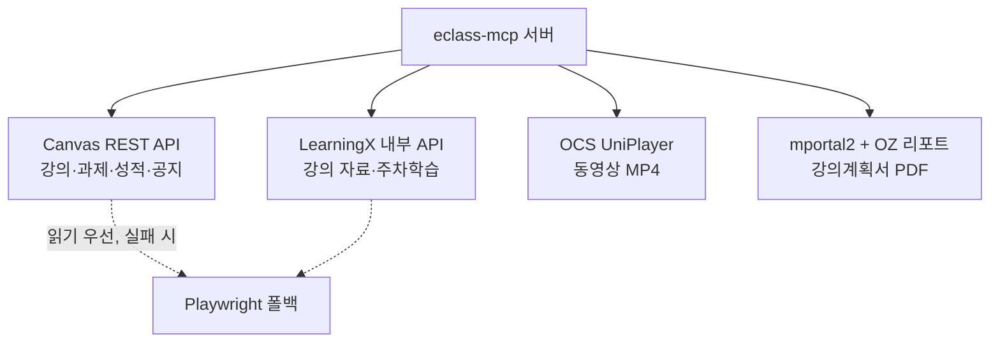

# eclass-mcp

[](LICENSE)
[](.nvmrc)
[](https://modelcontextprotocol.io)
[](#개발)

> **중앙대학교 eclass를 자연어로.** 시험 일정부터 과제 제출까지, LMS 작업을 Claude·Codex 같은 MCP 클라이언트의 도구로 노출하는 서버입니다.

중앙대 eclass(LearningX / Canvas LMS)를 다루는 **MCP 서버**입니다. 강의·과제·성적 조회,
자료/동영상 다운로드, 과제 제출, 기말시험 시간표 조회, 강의계획서(syllabus) 검색·조회를
하나의 도구 세트로 제공합니다. 인증(Keychain 토큰 캐시 → 만료 시 Playwright 자동 로그인),
타임아웃·재시도, 부분 실패 처리는 서버가 알아서 흡수하므로 클라이언트는 자연어 요청만
던지면 됩니다.

> [!WARNING]
> 개인 학습·편의용 **비공식** 도구입니다. **본인 계정으로 본인의 학습 데이터에만** 사용하세요.
> 사용에 따른 책임(LMS 이용약관·학칙 등)은 사용자 본인에게 있습니다.

## 목차

- [한눈에 보기](#한눈에-보기)
- [주요 기능](#주요-기능)
- [동작 원리](#동작-원리)
- [요구 사항](#요구-사항)
- [빠른 시작](#빠른-시작)
- [사용 예시](#사용-예시)
- [보안](#보안)
- [환경 변수](#환경-변수)
- [트러블슈팅](#트러블슈팅)
- [개발](#개발)
- [문서](#문서)
- [라이선스](#라이선스)

## 한눈에 보기

MCP 클라이언트에서 자연어로 요청하면 서버가 필요한 도구를 조합해 처리합니다.

```text
🙋  이번 주 마감 과제만 알려줘

🤖  (eclass_get_assignments { days_ahead: 7, include_submitted: false } 호출)

    이번 주 마감 임박 과제 2건입니다:
    • [운영체제] 스케줄러 구현 과제   — 6/16(월) 23:59 마감 · 미제출 · PDF only
    • [자료구조] 4주차 퀴즈           — 6/18(수) 23:59 마감 · 미제출

    제출하려면 파일 경로를 알려주세요. dry-run으로 먼저 검증해 드릴게요.
```

```text
🙋  운영체제 교재 보통 뭐 써?

🤖  (eclass_search_syllabus → eclass_get_syllabus 호출)

    '운영체제' 강의계획서 기준 주교재입니다:
    • Operating Systems: Three Easy Pieces — Arpaci-Dusseau
    평가비율: 출결 10 / 중간 45 / 기말 45.
```

> 위 대화는 동작을 보여주기 위한 예시입니다(값은 임의).

## 주요 기능

| 영역 | 할 수 있는 것 | 핵심 도구 |
|---|---|---|
| 강의 | 수강 목록 조회 (로컬 캐시 우선) | `eclass_get_courses`, `eclass_get_courses_cached` |
| 과제 | 마감 임박 과제·퀴즈 조회, 상세(제출 유형/확장자/마감) 확인 | `eclass_get_assignments`, `eclass_get_assignment_detail` |
| 과제 제출 | 파일/텍스트 제출 (기본 `dry_run`, 이중 제출 방지 검증) | `eclass_submit_assignment` |
| 성적 | 강의 단위 + 과제별 점수 | `eclass_get_grades` |
| 자료 | 강의 자료 목록 수집, 파일 일괄 다운로드 | `eclass_get_materials`, `eclass_download_materials_batch` |
| 동영상 | OCS UniPlayer MP4 동영상 다운로드 | `eclass_download_video` |
| 시험 시간표 | 기말시험 공지 PDF 파싱 → `course_id`로 시험 일시·장소 조회 | `eclass_sync_exam_schedules`, `eclass_get_exam_schedule` |
| 강의계획서 | 과목명/교수명으로 검색 → OZ 리포트 PDF를 구조화(교재·평가·주차일정) 조회 | `eclass_search_syllabus`, `eclass_get_syllabus` |
| 백업 | 강의 스냅샷을 JSON/Markdown으로 내보내기 | `eclass_export_course_snapshot` |
| 진단 | 인증·브라우저·API 사전 점검 | `eclass_doctor` |

전체 도구 명세와 파라미터는 [`docs/TOOLS.md`](docs/TOOLS.md)를 참고하세요.

- **시험 시간표** — 단과대 공지(예: 소프트웨어대학)는 학수번호+분반 exact match로, **교양대학 과목**은 강의명+분반 정규화 매칭으로 잡습니다(`matched_by`로 구분).
- **강의계획서** — CAU 포털(mportal2)+OZ 리포트 서버에서 받아오며, "OO 과목 교재 보통 뭐 써?" 같은 질문에 **학기와 무관하게** 답할 수 있습니다. PDF를 `pdftotext`로 파싱해 교재·평가비율·주차별 주제를 구조화하고 원문 전체를 `raw_text`로도 제공합니다.

## 동작 원리

인증은 OS 자격증명 저장소에 캐시된 토큰을 먼저 쓰고, 만료됐을 때만 Playwright로
자동 로그인해 토큰을 재발급·캐시합니다. **비밀번호는 OS 자격증명 저장소를 떠나지 않습니다.**


기능별로 가장 가벼운 백엔드를 우선 사용하고, 막히면 브라우저로 폴백합니다.



## 요구 사항

- **Node.js 24.x** — `engines`로 강제하며 `preinstall`에서 버전을 확인합니다.
- **pnpm**
- **OS 자격증명 저장소** — macOS Keychain / Linux Secret Service(libsecret). LMS 비밀번호 저장용.
- **Playwright Chromium** — 자동 로그인·일부 자료 인터셉트용. `postinstall`에서 자동 설치됩니다.
- **pdftotext**(poppler) — 시험 시간표·강의계획서 PDF 파싱용. 없으면 시험 동기화가 `EXAM_PARSER_UNAVAILABLE`을, 강의계획서 조회가 `SYLLABUS_PARSER_UNAVAILABLE`을 부분 실패로 남기고 **다른 기능은 정상 동작**합니다.
  - macOS: `brew install poppler`

## 빠른 시작

```bash
# 1) 설치 — 의존성 + better-sqlite3 rebuild + Chromium 설치(postinstall)
pnpm install

# 2) 빌드 — TypeScript → dist/
pnpm run build

# 3) 셋업 — 자격증명 저장 + MCP 클라이언트 설정 파일 자동 작성
pnpm run setup
```

`pnpm run setup`은 대화형으로 ID/비밀번호를 받아 **비밀번호는 OS 자격증명 저장소에 저장**하고
(설정 파일에 평문으로 남기지 않음), MCP 클라이언트 설정에 서버 항목을 써 줍니다.

- 설정 대상은 자동 감지하거나 `--target`으로 지정합니다.
  - `--target mcp-json` → 프로젝트의 `.mcp.json` (Claude Code 등)
  - `--target hermes` → Hermes config
  - `--target both`
- 셋업 끝에 `doctor` 점검이 돌며 인증·브라우저·API 상태를 확인합니다(`--no-doctor`로 생략).

생성되는 MCP 서버 항목은 다음 형태입니다. `pnpm start`는 stdout 배너가 JSON-RPC를
오염시키므로(`-32000`), 반드시 `node`로 직접 실행합니다.

```jsonc
{
  "mcpServers": {
    "eclass": {
      "command": "node",
      "args": ["<repo>/dist/index.js"],
      "env": { "ECLASS_USERNAME": "<your-id>" }
    }
  }
}
```

설정 후 MCP 클라이언트를 재시작(또는 재연결)하면 도구가 노출됩니다.

## 사용 예시

| 자연어 요청 | 서버가 하는 일 |
|---|---|
| "이번 학기 기말시험 언제 어디서 보는지 정리해줘" | 시험 동기화 후 `course_id`별 조회 |
| "이번 주 마감 과제만 보여줘" | `eclass_get_assignments { days_ahead: 7, include_submitted: false }` |
| "운영체제 강의 자료 안 받은 거 다 받아줘" | `eclass_get_materials` → `eclass_download_materials_batch` |
| "이 과제 제출 가능한지 먼저 확인해줘" | `eclass_get_assignment_detail` → `dry_run` 제출 |
| "운영체제 교재 보통 뭐 써?" | `eclass_search_syllabus` → `eclass_get_syllabus` |

자주 쓰는 도구 조합 흐름은 [`docs/TOOLS.md`의 "자주 쓰는 조합 흐름"](docs/TOOLS.md#자주-쓰는-조합-흐름)을 참고하세요.

## 보안

자격증명을 다루는 도구인 만큼 비밀 정보가 새지 않도록 설계했습니다.

- 🔐 **비밀번호는 OS 자격증명 저장소에만** 저장됩니다(Keychain / libsecret). repo·설정 파일·로그 어디에도 평문으로 남지 않습니다.
- 🚫 **평문 env 비밀번호**(`ECLASS_PASSWORD`)는 `ALLOW_PLAINTEXT_ENV_SECRETS=1`로 **명시적으로 켰을 때만** 사용되고, 기본값에서는 무시됩니다.
- 🙈 토큰·쿠키·CSRF·파일 바이트는 도구 결과나 디버그 로그에 노출되지 않습니다(과제 제출 결과에 토큰/쿠키/파일이 없음을 단언하는 테스트 포함).
- ✅ **과제 제출은 기본 `dry_run`** 이고, 기제출 과제는 `confirm_resubmit` 없이는 거부하는 이중 제출 방지 게이트가 있습니다.
- 🌐 외부로 나가는 트래픽은 **CAU 도메인 allowlist**로 제한됩니다.
- 💾 모든 데이터는 로컬에만 머뭅니다. 별도 외부 서버로 전송하지 않으며, 캐시 DB는 `~/.eclass-mcp`에 저장됩니다.

## 환경 변수

| 변수 | 기본값 | 용도 |
|---|---|---|
| `ECLASS_USERNAME` | (필수) | eclass 로그인 ID |
| `ECLASS_DOWNLOAD_DIR` | `~/Downloads/eclass` | 다운로드 저장 위치 |
| `ECLASS_DB_PATH` | `~/.eclass-mcp/files.db` | 다운로드/강의 캐시 DB |
| `ECLASS_EXAM_DB_PATH` | `~/.eclass-mcp/exams.db` | 시험 시간표 전용 DB |
| `ECLASS_CREDENTIAL_BACKEND` | keytar (가능 시) | `file` 지정 시 파일 저장소 강제 |
| `ALLOW_PLAINTEXT_ENV_SECRETS` | 꺼짐 | `1`일 때만 `ECLASS_PASSWORD` env 허용 |
| `DEBUG` | 꺼짐 | `1`이면 stderr 디버그 로그 |

## 트러블슈팅

| 증상 | 원인 / 해결 |
|---|---|
| MCP 연결 시 `-32000` 오류 | `pnpm start`로 띄우면 stdout 배너가 JSON-RPC를 오염시킵니다. **`node dist/index.js`로 직접 실행**하세요(셋업이 생성하는 설정도 이 형태). |
| 도구가 안 보임 / 실행 안 됨 | `pnpm run build`로 `dist/`를 먼저 빌드했는지, 클라이언트를 재시작했는지 확인하세요. |
| 시험·강의계획서 PDF 파싱이 비어 있음 | `pdftotext`(poppler)가 없을 때입니다. macOS는 `brew install poppler`. 다른 기능은 정상 동작합니다. |
| 첫 실행 시 키체인 접근 권한 요청 | OS 자격증명 저장소 접근 권한을 허용해야 토큰을 캐시할 수 있습니다. |
| 로그인·인증이 계속 실패 | `pnpm run doctor`로 인증·브라우저·API 상태를 점검하세요. |

## 개발

```bash
pnpm run dev      # tsx로 소스 직접 실행
pnpm test         # node --test 기반 테스트 (130개)
pnpm run build    # 타입체크 겸 빌드
pnpm run doctor   # 인증/브라우저/API 사전 점검
pnpm run discover # 엔드포인트 디스커버리 (docs/DISCOVERY.md)
```

## 문서

- [`docs/TOOLS.md`](docs/TOOLS.md) — 전체 도구 명세 및 사용 흐름
- [`docs/DISCOVERY.md`](docs/DISCOVERY.md) — eclass API 엔드포인트 디스커버리
- [`docs/SELF_REPAIR.md`](docs/SELF_REPAIR.md) — 시험 파서 등 자가 점검·복구 절차

## 라이선스

[MIT](LICENSE) © Jaeseok

CAU(중앙대학교) eclass 전용 비공식 도구입니다. 본인 계정으로 본인의 학습 데이터에만
사용하세요. 이 소프트웨어 사용으로 발생하는 결과(LMS 이용약관·학칙 위반 등)에 대한
책임은 사용자 본인에게 있으며, 저자는 어떠한 보증도 하지 않습니다.
