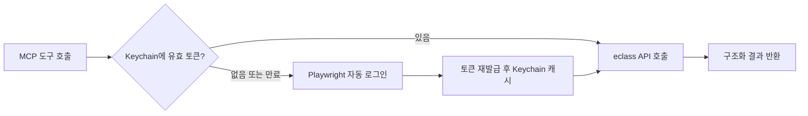
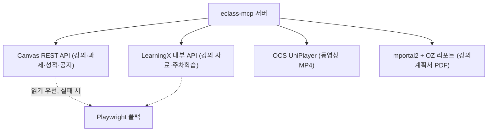

# eclass-mcp

[](LICENSE)
[](.nvmrc)
[](https://modelcontextprotocol.io)
[](#개발)

> **중앙대학교 eclass를 자연어로.** 시험 일정부터 과제 제출까지, LMS 작업을 Claude·Codex 같은 MCP 클라이언트의 도구로 노출하는 서버입니다.

중앙대 eclass(LearningX / Canvas LMS)를 다루는 **MCP 서버**입니다. 강의·과제·성적 조회,
자료/동영상 다운로드, 과제 제출, 기말시험 시간표 조회, 강의계획서(syllabus) 검색·조회를
하나의 도구 세트로 제공합니다. 인증(Keychain 토큰 캐시 → 만료 시 Playwright 자동 로그인),
타임아웃·재시도, 부분 실패 처리는 서버가 알아서 흡수하므로 클라이언트는 자연어 요청만
던지면 됩니다.

> [!WARNING]
> 개인 학습·편의용 **비공식** 도구입니다. **본인 계정으로 본인의 학습 데이터에만** 사용하세요.
> 사용에 따른 책임(LMS 이용약관·학칙 등)은 사용자 본인에게 있습니다.

## 목차

- [한눈에 보기](#한눈에-보기)
- [주요 기능](#주요-기능)
- [동작 원리](#동작-원리)
- [요구 사항](#요구-사항)
- [빠른 시작](#빠른-시작)
- [헤드리스 서버: 암호화 백엔드](#헤드리스-서버-암호화-백엔드)
- [ChatGPT 연결](#chatgpt-연결)
- [사용 예시](#사용-예시)
- [보안](#보안)
- [환경 변수](#환경-변수)
- [트러블슈팅](#트러블슈팅)
- [개발](#개발)
- [문서](#문서)
- [라이선스](#라이선스)

## 한눈에 보기

MCP 클라이언트에서 자연어로 요청하면 서버가 필요한 도구를 조합해 처리합니다.

```text
🙋  이번 주 마감 과제만 알려줘

🤖  (eclass_get_assignments { days_ahead: 7, include_submitted: false } 호출)

    이번 주 마감 임박 과제 2건입니다:
    • [운영체제] 스케줄러 구현 과제   — 6/16(월) 23:59 마감 · 미제출 · PDF only
    • [자료구조] 4주차 퀴즈           — 6/18(수) 23:59 마감 · 미제출

    제출하려면 파일 경로를 알려주세요. dry-run으로 먼저 검증해 드릴게요.
```

```text
🙋  운영체제 교재 보통 뭐 써?

🤖  (eclass_search_syllabus → eclass_get_syllabus 호출)

    '운영체제' 강의계획서 기준 주교재입니다:
    • Operating Systems: Three Easy Pieces — Arpaci-Dusseau
    평가비율: 출결 10 / 중간 45 / 기말 45.
```

> 위 대화는 동작을 보여주기 위한 예시입니다(값은 임의).

## 주요 기능

| 영역 | 할 수 있는 것 | 핵심 도구 |
|---|---|---|
| 강의 | 수강 목록 조회 (로컬 캐시 우선) | `eclass_get_courses`, `eclass_get_courses_cached` |
| 과제 | 마감 임박 과제·퀴즈 조회, 상세(제출 유형/확장자/마감) 확인 | `eclass_get_assignments`, `eclass_get_assignment_detail` |
| 과제 제출 | 파일/텍스트 제출 (기본 `dry_run`, 이중 제출 방지 검증) | `eclass_submit_assignment` |
| 성적 | 강의 단위 + 과제별 점수 | `eclass_get_grades` |
| 자료 | 강의 자료 목록 수집, 파일 일괄 다운로드, 다운로드 파일을 ChatGPT로 전달 | `eclass_get_materials`, `eclass_download_materials_batch`, `eclass_file_handoff` |
| 동영상 | OCS UniPlayer MP4 동영상 다운로드 | `eclass_download_video` |
| 시험 시간표 | 기말시험 공지 PDF 파싱 → `course_id`로 시험 일시·장소 조회 | `eclass_sync_exam_schedules`, `eclass_get_exam_schedule` |
| 강의계획서 | 과목명/교수명으로 검색 → OZ 리포트 PDF를 구조화(교재·평가·주차일정) 조회 | `eclass_search_syllabus`, `eclass_get_syllabus` |
| 백업 | 강의 스냅샷을 JSON/Markdown으로 내보내기 | `eclass_export_course_snapshot` |
| 진단 | 인증·브라우저·API 사전 점검 | `eclass_doctor` |

전체 도구 명세와 파라미터는 [`docs/TOOLS.md`](docs/TOOLS.md)를 참고하세요.

- **시험 시간표** — 단과대 공지(예: 소프트웨어대학)는 학수번호+분반 exact match로, **교양대학 과목**은 강의명+분반 정규화 매칭으로 잡습니다(`matched_by`로 구분).
- **강의계획서** — CAU 포털(mportal2)+OZ 리포트 서버에서 받아오며, "OO 과목 교재 보통 뭐 써?" 같은 질문에 **학기와 무관하게** 답합니다. PDF를 `pdftotext`로 파싱해 교재·평가비율·주차별 주제를 구조화하고 원문 전체를 `raw_text`로도 제공합니다.

## 동작 원리

인증은 OS 자격증명 저장소에 캐시된 토큰을 먼저 쓰고 만료됐을 때만 Playwright로
자동 로그인해 토큰을 재발급·캐시합니다. **비밀번호는 OS 자격증명 저장소를 떠나지 않습니다.**



기능별로 가장 가벼운 백엔드를 우선 쓰고 막히면 브라우저로 폴백합니다.



## 요구 사항

- **Node.js 24.x** — `engines`로 강제하며 `preinstall`에서 버전을 확인합니다.
- **pnpm**
- **자격증명 저장소** — 다음 중 하나에 LMS 비밀번호를 저장합니다.
  - **OS 자격증명 저장소** — macOS Keychain / Linux Secret Service(libsecret). 데스크톱 환경 기본값.
  - **암호화 파일 저장소**(`secrets.enc`) — Keychain/D-Bus가 없는 **헤드리스 Linux 서버**용. AES-256-GCM으로 암호화하고 마스터 키는 실행 시 env로 주입합니다(평문 저장 안 함). 자세한 내용은 [헤드리스 서버: 암호화 백엔드](#헤드리스-서버-암호화-백엔드).
- **Playwright Chromium** — 자동 로그인·일부 자료 인터셉트용. `postinstall`에서 자동 설치됩니다.
- **pdftotext**(poppler) — 시험 시간표·강의계획서 PDF 파싱용. 없으면 시험 동기화가 `EXAM_PARSER_UNAVAILABLE`을, 강의계획서 조회가 `SYLLABUS_PARSER_UNAVAILABLE`을 부분 실패로 남기고 **다른 기능은 정상 동작**합니다.
  - macOS: `brew install poppler`

## 빠른 시작

```bash
# 1) 설치 — 의존성 + better-sqlite3 rebuild + Chromium 설치(postinstall)
pnpm install

# 2) 빌드 — TypeScript → dist/
pnpm run build

# 3) 셋업 — 자격증명 저장 + MCP 클라이언트 설정 파일 자동 작성
pnpm run setup
```

`pnpm run setup`은 대화형으로 ID/비밀번호를 받아 **비밀번호는 OS 자격증명 저장소에 저장**하고
(설정 파일에 평문으로 남기지 않음), MCP 클라이언트 설정에 서버 항목을 써 줍니다.

- 설정 대상은 자동 감지하거나 `--target`으로 지정합니다.
  - `--target mcp-json` → 프로젝트의 `.mcp.json` (Claude Code 등)
  - `--target hermes` → Hermes config
  - `--target both`
  - `--target encrypted` → OS 저장소 대신 **암호화 파일 저장소**(`secrets.enc`)에 비밀번호 저장. 헤드리스 서버용 — [아래](#헤드리스-서버-암호화-백엔드) 참고.
- 셋업 끝에 `doctor` 점검이 돌며 인증·브라우저·API 상태를 확인합니다(`--no-doctor`로 생략). `doctor`는 어떤 자격증명 백엔드가 선택됐고 비밀번호가 조회되는지도 함께 보고합니다.

생성되는 MCP 서버 항목은 다음 형태입니다. `pnpm start`는 stdout 배너가 JSON-RPC를
오염시키므로(`-32000`), 반드시 `node`로 직접 실행합니다.

```jsonc
{
  "mcpServers": {
    "eclass": {
      "command": "node",
      "args": ["<repo>/dist/index.js"],
      "env": { "ECLASS_USERNAME": "<your-id>" }
    }
  }
}
```

설정 후 MCP 클라이언트를 재시작(또는 재연결)하면 도구가 노출됩니다.

## 헤드리스 서버: 암호화 백엔드

Keychain도 D-Bus(libsecret)도 없는 헤드리스 Linux 서버에서는 OS 자격증명 저장소를
쓸 수 없습니다. 이때는 비밀번호를 **AES-256-GCM으로 암호화한 파일**(`secrets.enc`,
기본 경로 `~/.eclass-mcp/secrets.enc`)에 저장하고, **마스터 키는 디스크에 남기지 않은 채
실행 시 env로 주입**합니다. 비밀번호는 어디에도 평문으로 저장되지 않습니다.

```bash
# 1) 암호화 백엔드로 셋업 — 마스터 키가 없으면 새로 생성해 한 번만 출력합니다.
npm run setup -- --target encrypted
#   → 출력된 ECLASS_SECRET_KEY 값을 비밀 관리 도구(또는 안전한 곳)에 보관하세요.
#     이 키를 잃으면 secrets.enc 를 복호화할 수 없습니다.

# 2) 이후 서버 실행 시마다 마스터 키를 주입합니다.
ECLASS_USERNAME=<your-id> \
ECLASS_CREDENTIAL_BACKEND=encrypted \
ECLASS_SECRET_KEY=<base64-32byte-key> \
node dist/index.js
```

마스터 키 주입 방식은 두 가지입니다.

- `ECLASS_SECRET_KEY` — 32바이트 키의 **base64** 문자열.
- `ECLASS_SECRET_KEY_FILE` — 키 파일 경로. **raw 32바이트** 또는 base64 텍스트 모두 인식합니다.

백엔드 선택 규칙(`ECLASS_CREDENTIAL_BACKEND`):

- 미설정(auto) — 마스터 키가 주입돼 있으면 `encrypted`, 아니면 keytar(가능 시), 둘 다
  없으면 파일 저장소.
- `encrypted` — 암호화 파일 저장소 강제. **마스터 키가 없으면 조용히 폴백하지 않고 오류**를 냅니다.
- `keytar` — OS 저장소 강제.
- `file` — (비권장) 평문 파일 저장소. `setup`은 평문 파일 저장을 **거부**합니다.

상태가 헷갈리면 `npm run doctor`가 활성 백엔드·마스터 키 주입 여부·keytar 로드
여부·비밀번호 조회 결과를 한 줄로 보고합니다. 비밀번호 조회 실패 시 오류 메시지에도
어떤 백엔드가 쓰였고 다음에 무엇을 실행해야 하는지가 포함됩니다.

## ChatGPT 연결

ChatGPT UI나 Responses API의 remote MCP 서버로 붙일 때는 HTTP transport를 사용합니다.
OpenAI Secure MCP Tunnel을 쓰는 자동 기동은 `npm run chatgptui`로 실행합니다
(자세히는 [`docs/CHATGPT_TUNNEL_SETUP.md`](docs/CHATGPT_TUNNEL_SETUP.md)).
v1은 **개인용 단일 사용자 서버**입니다. 서버가 실행되는 머신의 `ECLASS_USERNAME`과
자격증명 저장소(OS 저장소 또는 암호화 파일)에 저장된 LMS 비밀번호를 사용하며, ChatGPT
사용자별 OAuth linking은 아직 지원하지 않습니다. 헤드리스 Linux 서버라면 OS 저장소
대신 [암호화 백엔드](#헤드리스-서버-암호화-백엔드)로 준비하고 실행 시 `ECLASS_SECRET_KEY`를
함께 주입하세요.

```bash
# 1) stdio 설정과 동일하게 credential store를 먼저 준비
#    (헤드리스 서버는 `pnpm run setup -- --target encrypted`)
pnpm run setup

# 2) 빌드
pnpm run build

# 3) 로컬 remote MCP 서버 실행
ECLASS_USERNAME=<your-id> \
ECLASS_REMOTE_AUTH_TOKEN=<long-random-token> \
node dist/index.js --http --port 8787

# 개발 중 ChatGPT에서 접근할 HTTPS URL 노출
ngrok http 8787
```

ChatGPT에서는 **Settings → Apps & Connectors → Advanced settings**에서 Developer Mode를
켠 뒤, connector/app 생성 화면에 tunnel URL의 `/mcp` 경로를 넣습니다.

```text
https://<subdomain>.ngrok.app/mcp
```

HTTP 서버는 다음을 지원합니다.

- `GET /` — health check
- `POST/GET/DELETE /mcp` — MCP Streamable HTTP transport
- `ECLASS_REMOTE_AUTH_TOKEN` — 설정 시 `Authorization: Bearer <token>`이 없는 `/mcp`
  요청을 거부
- `ECLASS_HTTP_ALLOWED_ORIGINS` — 콤마로 구분한 CORS origin allowlist. 미설정 시 DNS
  리바인딩/로컬 CSRF 방지를 위해 `Origin` 헤더가 있는 브라우저 요청은 거부하고,
  `Origin` 없는 MCP 클라이언트 요청만 허용

로컬에서만 시험할 때는 `pnpm run dev:http`를 사용할 수 있고, 빌드 후에는
`pnpm run start:http`가 `node dist/index.js --http --port 8787`을 실행합니다.
공개 URL로 노출할 때는 반드시 `ECLASS_REMOTE_AUTH_TOKEN`이나 tunnel 접근 제어를 두세요.
도구/metadata 변경 후에는 ChatGPT connector 설정에서 refresh해야 새 descriptor가 반영됩니다.

## 사용 예시

| 자연어 요청 | 서버가 하는 일 |
|---|---|
| "이번 학기 기말시험 언제 어디서 보는지 정리해줘" | 시험 동기화 후 `course_id`별 조회 |
| "이번 주 마감 과제만 보여줘" | `eclass_get_assignments { days_ahead: 7, include_submitted: false }` |
| "운영체제 강의 자료 안 받은 거 다 받아줘" | `eclass_get_materials` → `eclass_download_materials_batch` |
| "이 과제 제출 가능한지 먼저 확인해줘" | `eclass_get_assignment_detail` → `dry_run` 제출 |
| "운영체제 교재 보통 뭐 써?" | `eclass_search_syllabus` → `eclass_get_syllabus` |

자주 쓰는 도구 조합 흐름은 [`docs/TOOLS.md`의 "자주 쓰는 조합 흐름"](docs/TOOLS.md#자주-쓰는-조합-흐름)을 참고하세요.

## 보안

자격증명을 다루는 도구인 만큼 비밀 정보가 새지 않도록 설계했습니다.

- 🔐 **비밀번호는 OS 자격증명 저장소**(Keychain / libsecret) **또는 AES-256-GCM 암호화 파일**(`secrets.enc`)에만 저장됩니다. 암호화 파일의 마스터 키는 디스크에 두지 않고 실행 시 env로 주입합니다. repo·설정 파일·로그 어디에도 비밀번호가 평문으로 남지 않으며, `setup`은 평문 파일 저장소를 **거부**합니다.
- 🚫 **평문 env 비밀번호**(`ECLASS_PASSWORD`)는 `ALLOW_PLAINTEXT_ENV_SECRETS=1`로 **명시적으로 켰을 때만** 사용되고, 기본값에서는 무시됩니다.
- 🙈 토큰·쿠키·CSRF·파일 바이트는 도구 결과나 디버그 로그에 노출되지 않습니다(과제 제출 결과에 토큰/쿠키/파일이 없음을 단언하는 테스트 포함).
- ✅ **과제 제출은 기본 `dry_run`** 이고, 기제출 과제는 `confirm_resubmit` 없이는 거부하는 이중 제출 방지 게이트가 있습니다.
- 🌐 외부로 나가는 트래픽은 **CAU 도메인 allowlist**로 제한됩니다.
- 💾 모든 데이터는 로컬에만 머뭅니다. 별도 외부 서버로 전송하지 않으며, 캐시 DB는 `~/.eclass-mcp`에 저장됩니다.

## 환경 변수

| 변수 | 기본값 | 용도 |
|---|---|---|
| `ECLASS_USERNAME` | (필수) | eclass 로그인 ID |
| `ECLASS_DOWNLOAD_DIR` | `~/Downloads/eclass` | 다운로드 저장 위치 |
| `ECLASS_DB_PATH` | `~/.eclass-mcp/files.db` | 다운로드/강의 캐시 DB |
| `ECLASS_EXAM_DB_PATH` | `~/.eclass-mcp/exams.db` | 시험 시간표 전용 DB |
| `ECLASS_HANDOFF_MAX_BYTES` | `26214400` | `eclass_file_handoff`가 전달할 파일의 최대 크기(바이트). 기본 25MB |
| `ECLASS_CREDENTIAL_BACKEND` | auto | `encrypted` / `keytar` / `file` 강제. auto는 마스터 키 있으면 encrypted, 아니면 keytar, 둘 다 없으면 file |
| `ECLASS_SECRET_KEY` | (없음) | 암호화 백엔드 마스터 키(32바이트 base64). 실행 시 주입 |
| `ECLASS_SECRET_KEY_FILE` | (없음) | 마스터 키 파일 경로(raw 32바이트 또는 base64 텍스트) |
| `ECLASS_ENC_STORE_PATH` | `~/.eclass-mcp/secrets.enc` | 암호화 비밀번호 파일 경로 |
| `ALLOW_PLAINTEXT_ENV_SECRETS` | 꺼짐 | `1`일 때만 `ECLASS_PASSWORD` env 허용 |
| `ECLASS_TRANSPORT` | `stdio` | `http`로 지정하면 remote MCP HTTP 서버 실행 |
| `ECLASS_HTTP_PORT` / `PORT` | `8787` | HTTP transport 포트 |
| `ECLASS_REMOTE_AUTH_TOKEN` | (없음) | 설정 시 `/mcp` Bearer 또는 `X-Eclass-Auth` 인증 강제 |
| `ECLASS_HTTP_ALLOWED_ORIGINS` | Origin 요청 기본 거부 | HTTP CORS origin allowlist (콤마 구분) |
| `CONTROL_PLANE_API_KEY` | (없음) | OpenAI tunnel 런타임 API 키 (Tunnels Read+Use). `npm run chatgptui`에서 사용 |
| `CONTROL_PLANE_TUNNEL_ID` | (없음) | tunnel 식별자 (Platform Tunnels 발급) |
| `ECLASS_TUNNEL_PROFILE_FILE` | `${XDG_CONFIG_HOME:-~/.config}/tunnel-client/eclass-mcp.yaml` | tunnel-client 프로파일 경로 오버라이드 |
| `DEBUG` | 꺼짐 | `1`이면 stderr 디버그 로그 |

## 트러블슈팅

| 증상 | 원인 / 해결 |
|---|---|
| MCP 연결 시 `-32000` 오류 | `pnpm start`로 띄우면 stdout 배너가 JSON-RPC를 오염시킵니다. **`node dist/index.js`로 직접 실행**하세요(셋업이 생성하는 설정도 이 형태). |
| 도구가 안 보임 / 실행 안 됨 | `pnpm run build`로 `dist/`를 먼저 빌드했는지, 클라이언트를 재시작했는지 확인하세요. |
| 시험·강의계획서 PDF 파싱이 비어 있음 | `pdftotext`(poppler)가 없을 때입니다. macOS는 `brew install poppler`. 다른 기능은 정상 동작합니다. |
| 첫 실행 시 키체인 접근 권한 요청 | OS 자격증명 저장소 접근 권한을 허용해야 토큰을 캐시할 수 있습니다. |
| 헤드리스 서버에서 비밀번호를 못 찾음(`Password not found ... backend=...`) | Keychain/D-Bus가 없는 환경입니다. `npm run setup -- --target encrypted`로 암호화 저장소를 만들고, 실행 시 `ECLASS_CREDENTIAL_BACKEND=encrypted`와 `ECLASS_SECRET_KEY`를 주입하세요. 오류 메시지가 활성 백엔드와 다음 조치를 알려줍니다. [암호화 백엔드](#헤드리스-서버-암호화-백엔드) 참고. |
| 로그인·인증이 계속 실패 | `pnpm run doctor`로 인증·브라우저·API·자격증명 백엔드 상태를 점검하세요. |

## 개발

```bash
pnpm run dev      # tsx로 소스 직접 실행
pnpm run dev:http # tsx로 HTTP /mcp 개발 서버 실행 (:8787)
pnpm test         # node --test 기반 테스트 (133개)
pnpm run build    # 타입체크 겸 빌드
pnpm run start:http # 빌드된 HTTP /mcp 서버 실행 (:8787)
pnpm run doctor   # 인증/브라우저/API 사전 점검
pnpm run discover # 엔드포인트 디스커버리 (docs/DISCOVERY.md)
```

## 문서

- [`docs/TOOLS.md`](docs/TOOLS.md) — 전체 도구 명세 및 사용 흐름
- [`docs/CHATGPT_TUNNEL_SETUP.md`](docs/CHATGPT_TUNNEL_SETUP.md) — ChatGPT Secure MCP Tunnel 셋업
- [`docs/DISCOVERY.md`](docs/DISCOVERY.md) — eclass API 엔드포인트 디스커버리
- [`docs/SELF_REPAIR.md`](docs/SELF_REPAIR.md) — 시험 파서 등 자가 점검·복구 절차

## Claude Code 스킬 (선택)

MCP 툴을 정해진 순서로 조합하도록 안내하는 `eclass-cau` 스킬이 `skills/`에 동봉돼
있습니다. Claude Code에서 활성화하려면:

```bash
npm run install:skill
```

`~/.claude/skills/eclass-cau`를 이 repo로 심볼릭 링크하므로, `git pull`로 repo를
업데이트하면 스킬도 자동으로 최신 상태가 됩니다. (스킬 본문은 흐름·순서만 담고,
파라미터 명세는 `docs/TOOLS.md`를 그대로 가리킵니다.)

## 라이선스

[MIT](LICENSE) © Jaeseok

CAU(중앙대학교) eclass 전용 비공식 도구입니다. 본인 계정으로 본인의 학습 데이터에만
사용하세요. 이 소프트웨어 사용으로 발생하는 결과(LMS 이용약관·학칙 위반 등)에 대한
책임은 사용자 본인에게 있으며, 저자는 어떠한 보증도 하지 않습니다.
